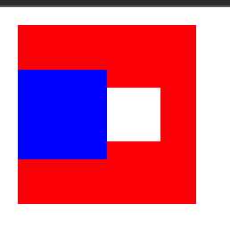

# leafer-flex-plugin

## Installation

```bash
npm install leafer-flex-plugin
```

## Usage



```js
import { Box, Leafer, Rect, UI, usePlugin } from 'leafer-ui'
import plugin from 'leafer-flex-plugin'

usePlugin(plugin)

const leafer = new Leafer({ view: window })

const box = new Box({
  width: 100,
  height: 100,
  fill: 'red',
  draggable: true,
  // 外边距
  margin: 10,
  // 横向排列
  flexDirection: 'row',
  // 主轴对齐方式
  alignItems: 'center',
})

const rect = new Rect({
  width: 50,
  height: 50,
  fill: 'blue',
})

const ui = UI.one({
  tag: 'Rect',
  alignContent: 'center',
  width: 30,
  height: 30,
  fill: '#fff',
})

leafer.add(box)
box.add(rect)
box.add(ui)
```

## ts类型安全

```ts
import type { BoxFlexData } from 'leafer-flex-plugin'
import plugin from 'leafer-flex-plugin'

const box = new Box({
  width: 100,
  height: 100,
  fill: 'red',
  draggable: true,
  // 外边距
  margin: 10,
  // 横向排列
  flexDirection: 'row',
  // 主轴对齐方式
  alignItems: 'center',
} as BoxFlexData)
```
